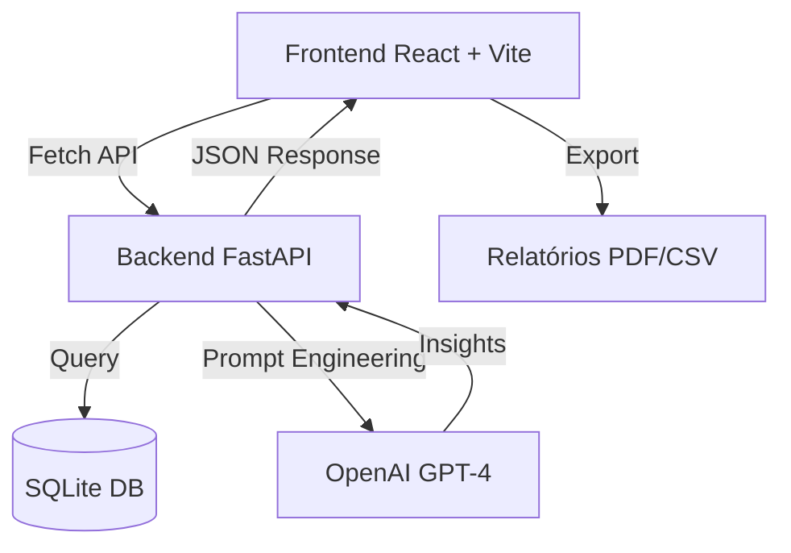

# 🚀 SmartHR: Inteligência Artificial na Gestão de Capital Humano

<p align="center">
  
  
  
  
  
  
</p>

## 📌 Visão Geral

O **SmartHR** é uma plataforma inovadora de CRM/Analytics para Recursos Humanos que utiliza **Inteligência Artificial Generativa** para transformar dados brutos de folha de pagamento em insights estratégicos. 

Diferente de sistemas de RH tradicionais, o SmartHR automatiza a detecção de anomalias operacionais (como excesso de horas extras ou riscos de rotatividade) e gera relatórios executivos em segundos, permitindo que gestores foquem na estratégia e não em planilhas.

---

## 🏗️ Arquitetura da Solução

O projeto é estruturado como uma aplicação **Full-Stack** moderna:



### 🛠️ Tecnologias e Linguagens

-   **Frontend:**
    -   **Javascript (ES6+)**: Lógica da interface.
    -   **React 19**: Biblioteca para construção de interfaces reativas.
    -   **Vite**: Build tool ultrarrápido.
    -   **Vanilla CSS**: Estilização premium com transições e dark mode.
-   **Backend:**
    -   **Python 3.11**: Linguagem principal do servidor.
    -   **FastAPI**: Framework web de alta performance.
    -   **Pandas**: Processamento e limpeza de dados (ETL).
    -   **OpenAI SDK**: Integração com modelos de linguagem.
    -   **SQLite**: Banco de dados relacional leve e embutido.

---

## ✨ Principais Funcionalidades

-   **📊 Dashboard de Controladoria**: Visualização instantânea de custos por departamento e headcount.
-   **🤖 AuditAICore**: Detecção proativa de anomalias (análise de risco em tempo real).
-   **📝 Relatórios Automáticos**: Geração de análises descritivas em Markdown via IA.
-   **📤 Integração ERP**: Facilidade de importação/exportação via arquivos JSON/CSV.
-   **🔐 Acesso Restrito**: Sistema de autenticação corporativa.
-   **📄 Geração de Documentos**: Download de holerites e centros de custo em PDF.

---

## 🚀 Como Executar Localmente

### 1. Requisitos Próximos
-   Python 3.10+
-   Node.js 18+
-   Chave de API da OpenAI

### 2. Configuração do Backend
```bash
# Navegue até a raiz do projeto
# Crie e ative o ambiente virtual
python -m venv venv
source venv/bin/activate  # Linux/Mac
venv\Scripts\activate     # Windows

# Instale as dependências
pip install -r requirements.txt

# Configure o .env
cp .env.example .env
# Adicione sua OPENAI_API_KEY no arquivo .env

# Inicie o servidor
uvicorn src.api:app --reload --port 8001
```

### 3. Configuração do Frontend
```bash
cd frontend
npm install
npm run dev
```
O frontend estará disponível em `http://localhost:5173`.

---

## 🌐 Deploy no Render

Este repositório está pronto para deploy no **Render** via arquivo `render.yaml`.

[](https://render.com/deploy)

**Passos:**
1.  Conecte seu GitHub ao Render.
2.  Crie um novo **Blueprint Instance**.
3.  Configure a variável de ambiente `OPENAI_API_KEY` no dashboard do Render.

---

## 📄 Licença
Este projeto está licenciado sob a [MIT License](LICENSE).

---

<p align="center">
  Desenvolvido por <strong>Victor Melo</strong>
</p>
